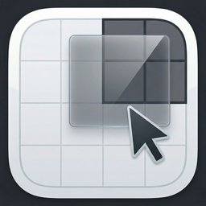

<p align="center">
  
</p>

<h1 align="center">ClickFit</h1>

<p align="center">
  <strong>Every window, exactly where you want it.</strong><br />
  Effortless window management for macOS.
</p>

<p align="center">
  <a href="https://clickfitapp.com/#download"></a>
  <a href="https://clickfitapp.com"></a>
</p>

<p align="center">
  
  
  
  
</p>

---

Move, resize, and snap any window with modifier-click gestures. A native menu bar app that stays invisible until you need it.

## Features

### Mouse Move & Resize

Hold a modifier key and **left-click drag** to move any window from anywhere. **Right-click drag** to resize from any position — no need to find tiny edges or title bars.

### Edge Snapping & Tiling

Drag windows to screen edges to snap into tiled positions. **9 tile zones** — halves, quarters, and full screen — with visual overlay previews before you drop.

### Smart Snap & Coupled Resize

Windows automatically snap to each other's edges. Grab a shared border and both windows resize together in sync — your layout stays perfectly aligned.

### Keyboard Shortcuts

Customizable global hotkeys for tiling, centering, maximizing, layouts, and cross-display moves.

### Predefined Layouts

Instantly arrange windows into **9 layout presets**: columns, rows, grids, and split ratios.

### Multi-Monitor & Spaces

Move windows between displays and virtual desktops with a keystroke.

### Adaptive Tiling

Tile zones detect anchored neighbors and expand to fill remaining space automatically.

### Lightweight & Fast

Native Swift with vsync-aligned updates. Under 20MB, minimal memory footprint.

## System Requirements

- macOS 15 Sequoia or later
- Apple Silicon & Intel supported
- Accessibility permission required (System Settings > Privacy & Security > Accessibility)

## Website

This repository contains the source code for [clickfitapp.com](https://clickfitapp.com), the official ClickFit landing page. Built with [Astro](https://astro.build) and [Tailwind CSS](https://tailwindcss.com), deployed via GitHub Pages.

### Development

```bash
npm install       # Install dependencies
npm run dev       # Start dev server at localhost:4321
npm run build     # Build production site to ./dist/
npm run preview   # Preview production build locally
```

### Deployment

The site is automatically deployed to GitHub Pages on push to `main`. The custom domain `clickfitapp.com` is configured via the `CNAME` file.

---

<p align="center">
  &copy; 2026 ClickFit. All rights reserved.
</p>
